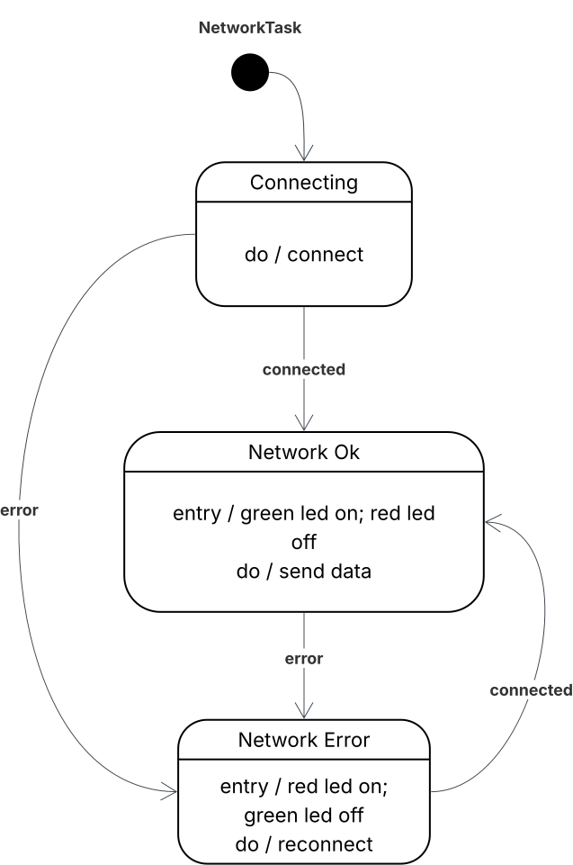
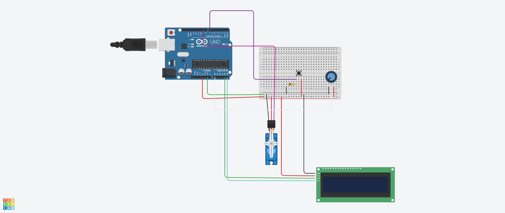
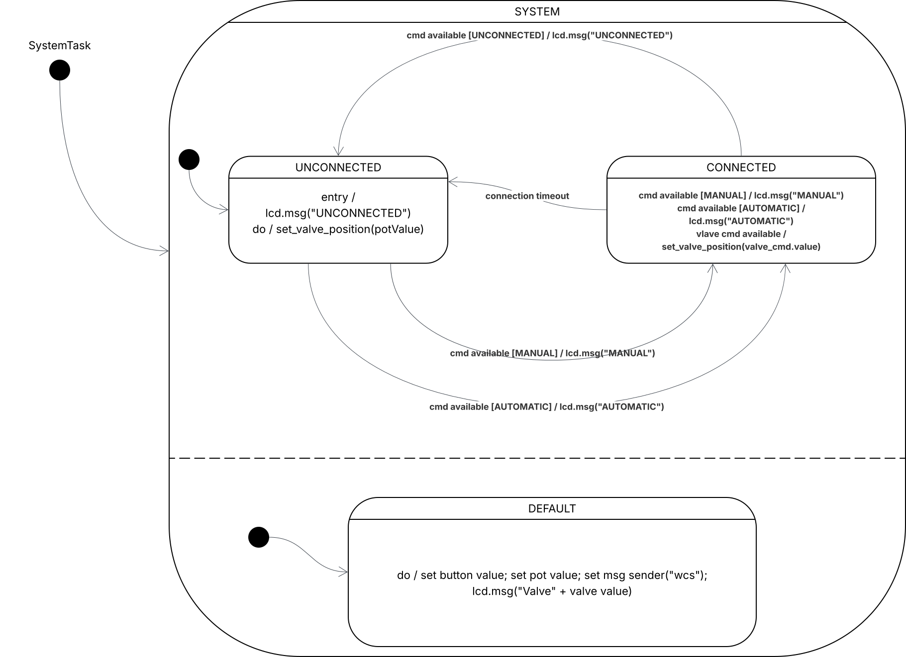
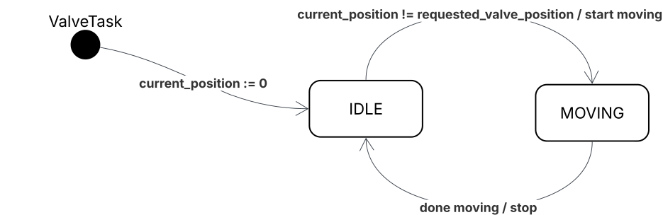
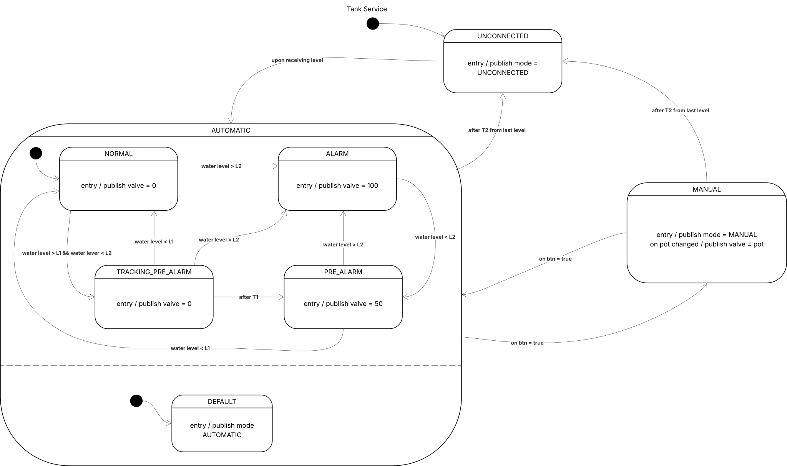
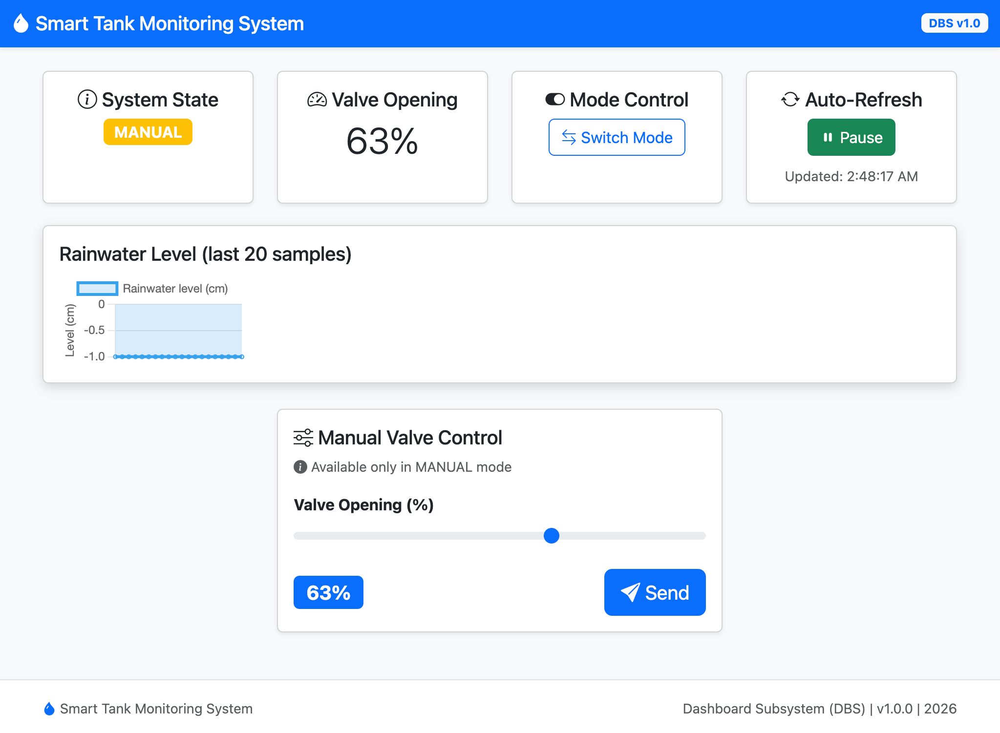

# Assignment #03 - *Smart Tank Monitoring System*

## Authors

**Filippo Greppi**
- Email: <filippo.greppi2@studio.unibo.it>
- Student ID: 0001114837
 
**Marcello Spagnoli**  
- Email: <marcello.spagnoli2@studio.unibo.it>  
- Student ID: 0001117244  

---

## Introduction

The **Smart Tank Monitoring System** is a distributed IoT system for monitoring and controlling rainwater levels in a tank. The system automatically manages the opening of a valve to drain water into a channel network when the level exceeds certain thresholds or allows manual control via a web dashboard or a physical potentiometer. The system also provides real-time visualization of water levels and valve status.

## System Architecture

The system consists of **4 independent subsystems** that communicate with each other:

### Operating Modes
- **AUTOMATIC**: The system automatically controls valve opening based on water level
- **MANUAL**: The operator manually controls opening via potentiometer or dashboard
- **UNCONNECTED**: Error state when TMS doesn't communicate with CUS for more than T₂

---

### Tank Monitoring Subsystem (TMS)

**Platform**: ESP32 with FreeRTOS

**Hardware Components**:
- Sonar sensor (HC-SR04) for water level measurement
- Green LED (alive/connection OK indicator)
- Red LED (error/network problem indicator)

**Software Architecture**:
Two independent tasks running on FreeRTOS:

1. **SensorsTask**: Samples water level periodically and stores data in shared context
2. **NetworkTask**: FSM managing WiFi/MQTT connection and data transmission

**Network Task FSM**:

**States**:
- **CONNECTING**: Establishing WiFi and MQTT connection
- **NETWORK_OK**: Connected, transmitting data (Green LED ON)
- **NETWORK_ERROR**: Connection lost, attempting reconnect (Red LED ON)

### Water Channel Subsystem (WCS)

**Platform**: Arduino UNO with cooperative scheduler

**Hardware Components**:
- Servo motor (valve control, 0° = closed, 90° = 100% open)
- Push button (mode switch)
- Potentiometer (manual valve control)
- LCD display (20x4)

**Software Architecture**:
Task-based architecture with 4 cooperative tasks:

1. **SystemTask**: FSM managing connection state (UNCONNECTED/CONNECTED) and mode switching
2. **ValveTask**: FSM controlling servo motor movement (IDLE/MOVING)
3. **MsgTask**: Serial communication with CUS (JSON commands/events)
4. **LCDTask**: Updates LCD display with valve position and mode

**System Task FSM**:

**States**:
- **UNCONNECTED**: No CUS communication, potentiometer controls valve
- **CONNECTED**: CUS commands control valve, displays AUTOMATIC/MANUAL mode

**Valve Task FSM**:

**States**:
- **IDLE**: Servo off, waiting for position change
- **MOVING**: Servo active, moving to target position

### Control Unit Subsystem (CUS)

Built as event-driven microservice architecture using Python's asyncio framework.
It uses the state pattern to implement the control policy for valve management based on TMS data and operator input.
It is composed by a central event bus using the pub/sub pattern, and the services:
Tank Service is the core FSM implementing the control policy, while the others are responsible for communication with the other subsystems (SerialService for WCS, MQTTService for TMS, HttpService for DBS).

**Platform**: Python (asyncio-based architecture)

**Architecture Components**:
1. **EventBus**: Pub/sub message broker for inter-service communication
2. **TankService**: Core FSM implementing control policy
3. **SerialService**: JSON communication with WCS via serial port
4. **MQTTService**: Level data reception from TMS
5. **HttpService**: REST API (FastAPI) for DBS

**TankService FSM**:

**System States**:
- **UNCONNECTED**: No TMS data received, waiting for first level reading
- **AUTOMATIC**: FSM controls valve with 4 substates:
  - **NORMAL**: Level OK, valve 0%
  - **TRACKING_PRE_ALARM**: L1 < level < L2, starting T1 timer
  - **PRE_ALARM**: T1 expired, valve 50%
  - **ALARM**: Level ≥ L2, valve 100%
- **MANUAL**: Operator controls valve via potentiometer/dashboard

**Transitions**:
- Button press toggles AUTOMATIC ↔ MANUAL
- T2 timeout (no TMS data) → UNCONNECTED from any state

---

### Dashboard Subsystem (DBS)

**Platform**: Web Application (Browser)  
**Technologies**: HTML5, Bootstrap 5, Chart.js 4, Vanilla JavaScript

**Architecture**:

The DBS is a single-page web application that provides a real-time monitoring and control interface for the Smart Tank System. It communicates with the CUS via REST API (HTTP) with a polling-based approach.

**Key Components**:

1. **State Management**
   - Polling interval: 2 seconds (configurable via `POLL_INTERVAL_MS`)
   - Auto-refresh mechanism with pause/resume capability

2. **Data Visualization**
   - Real-time line chart using Chart.js with time-series support
   - Displays last 20 water level samples (configurable via `MAX_READINGS`)

3. **REST API Integration**
   - `GET /api/v1/levels`: Fetches historical level readings
   - `GET /api/v1/mode`: Retrieves current system state
   - `GET /api/v1/valve`: Gets current valve opening percentage
   - `POST /api/v1/change`: Toggles AUTOMATIC ↔ MANUAL mode
   - `POST /api/v1/pot`: Sends manual valve opening command (0-100%)

4. **User Interface Features**
   - **Status Cards**:
     - System State badge with color coding (green=AUTOMATIC, yellow=MANUAL, red=UNCONNECTED, gray=NOT_AVAILABLE)
     - Valve opening percentage display
     - Mode switch button
     - Auto-refresh toggle with last update timestamp
   
   - **Manual Control Panel** (enabled only in MANUAL mode):
     - Range slider (0-100%) for valve opening control
     - Send button to apply selected valve position
     - Visual feedback via slider value badge
   
   - **Notifications**:
     - Toast notifications for operation feedback (success/error)
     - Loading overlay during initial data fetch

## Demo Video

[Watch the demonstration video](https://liveunibo-my.sharepoint.com/:v:/g/personal/filippo_greppi2_studio_unibo_it/IQDeM8AzXj4vT530_44pwb-SAQ6p9UIpJB-1nDFXG11v5kQ?nav=eyJyZWZlcnJhbEluZm8iOnsicmVmZXJyYWxBcHAiOiJPbmVEcml2ZUZvckJ1c2luZXNzIiwicmVmZXJyYWxBcHBQbGF0Zm9ybSI6IldlYiIsInJlZmVycmFsTW9kZSI6InZpZXciLCJyZWZlcnJhbFZpZXciOiJNeUZpbGVzTGlua0NvcHkifX0&e=RQHUjg)

